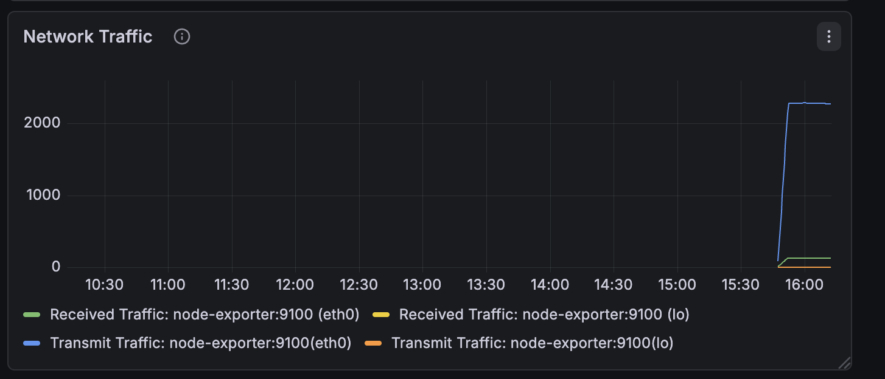
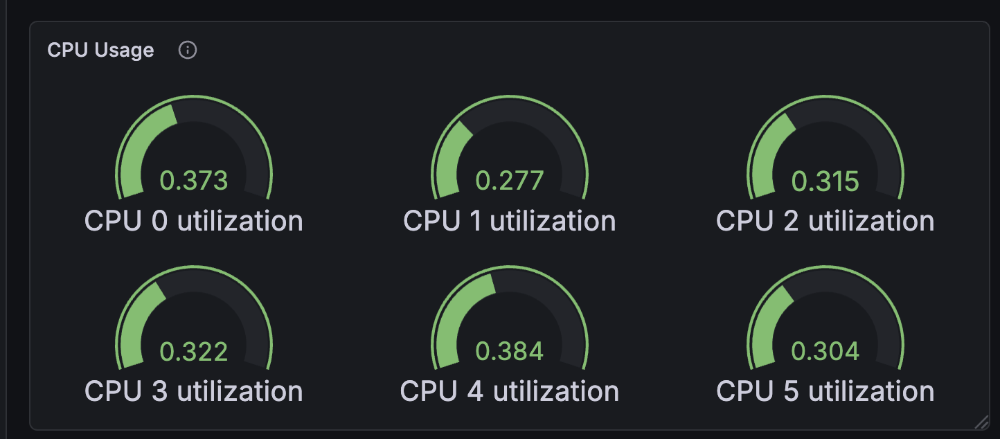
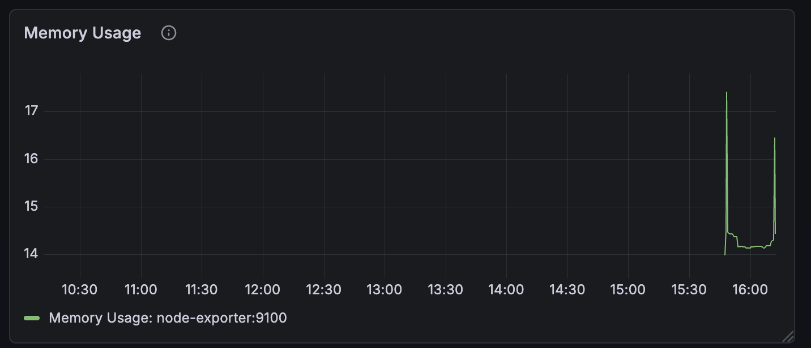

This project implements a network monitoring system using Prometheus and Grafana to track system performance and detect issues in real time.

<!-- Badges -->

  
  

## Grafana Dashboard
### Network Traffic

### CPU Usage

### Memory Usage

## Architecture
The system consists of:
- Node Exporter (metrics collection)
- Prometheus (data collection and storage)
- Grafana (visualization)

Data flows from monitored systems -> Prometheus -> Grafana dashboards

Prometheus was chosen for its pull-based model, which improves reliability in dynamic environments compared to push-based systems.
Grafana enables flexible visualization, allowing operators to quickly identify anomalies and trends in system performance.
Node Exporter provides lightweight system-level metrics without requiring heavy agents.

## Components

| Component | Port | Function |
|----------|------|----------|
| Node Exporter | 9100 | Exposes system metrics |
| Prometheus | 9090 | Collects and stores metrics |
| Grafana | 3000 | Visualizes data |

## Setup

1. Clone repo
2. Run:
   docker compose up -d
3. Access:
   - Grafana: http://<ip of vm>:3000
   - Prometheus: http://<ip of vm>:9090

## Dashboards

- CPU usage
- Memory usage
- Network traffic
- System uptime

## Automation

Scripts included:

- health_check.py → checks device availability
- log_monitor.py → scans logs for errors
- alerting.py → triggers alerts

## Troubleshooting

- Check container status:
  docker ps
- Check logs:
  docker logs <container>

## Future Improvements

- Add SNMP monitoring
- Integrate alert notifications (Slack/email)
- Monitor multiple nodes